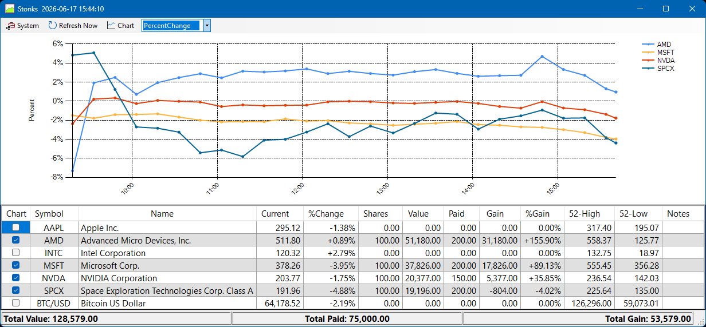
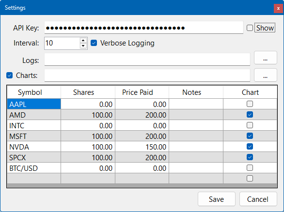

# Stonks
A personal stock-ticker project for Windows desktop. 
It uses Twelve Data API (I use the Free Tier) to fetch stock data and displays it in a simple, customizable interface. 
The project is built using .NET Framework (4.8.1) and C# on Visual Studio 2026.
It allows users to track their favorite stocks in real-time, with options for customization. 
The project is open-source and available on GitHub for anyone interested in using it for their own purposes.

MainForm is the main interface where users can view their stock list, and see various charts related to their stock performance.

 

SettingForm is where users can customize their stock list, set the refresh interval for fetching stock data, and configure other settings related to the application.

# Features
- Real-time stock data fetching using Twelve Data API (default is 10 minutes, but can be customized)
- Customizable stock list with options to add/remove stocks
- Simple and clean user interface
- Display of various charts (price, percentage change, value, etc.)
- Hover over chart legend to highlight corresponding data points on the chart
- Logs for tracking stock performance over time

# Installation
1. Download the latest release from the GitHub repository. This is in MSI format, so it should be easy to install on any Windows machine.
2. Run the downloaded MSI file and follow the installation wizard.
3. Once installed, launch the application from the Start Menu or desktop shortcut.
4. Upon first launch, you will need to install the Twelve Data API key and configure your stock list and refresh interval in the Settings menu.
5. Right-click on the application icon in the system tray to access the settings and customize your stock list and refresh interval.
6. Enjoy tracking your stocks!

# Notes
- Make sure to obtain an API key from TwelveData.com and configure it in the application settings for it to work properly.
- The application is designed for personal use and may not be suitable for professional trading or financial analysis.
- This is actually the 2.0 version to an internal project. I decided to release it as open-source after some improvements and refactoring. The original version was more of a learning project, while this version is more polished and user-friendly.
- The logs and chart data are stored in **%LOCALAPPDATA%\£ordÇhariot\Stonks.exe_\<HASH\>\\[charts|logs]** by default. 
You can access these folders to view historical data or backup your logs and charts. 
However, there is no log cleanup capability, so you may have to perodically delete them.
You may open the displayed log folder in the Log Viewer with the **File -> Open Folder in File Explorer** menu option. 

# Contributing
This is a personal project. Although you can suggest features or report issues, I may not be able to actively maintain or update the project.

